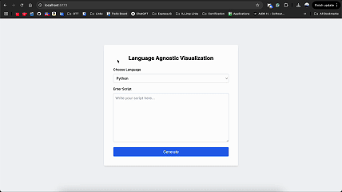

# Language-Agnostic Visualization Web Application

This project enables users to write Python or R scripts and visualize them through an intuitive frontend and a secure backend.

---



---

# Language-Agnostic Visualization Frontend

This is the **ReactJS-based frontend** for the Language-Agnostic Visualization Web Application. It allows users to submit Python or R scripts and visualize the results (static, interactive, or 3D) via an intuitive UI.

---

## Tech Stack

- **ReactJS** (with Hooks)

- **TypeScript**

- **Tailwind CSS** for utility-first styling

- **Axios** for API calls

- **Vite** (for fast build and dev environment)

---

## UI Design Overview

- Dropdown menu to select the language (Python / R)

- Textarea for users to write visualization scripts

- A `Generate` button to submit the code

- Automatically renders the resulting visualization as an `<iframe>`

---

## How to Run

```bash

npm  install

npm  run  dev

```

Your frontend would be running in http://localhost:5173/.

Make sure your backend is running at http://127.0.0.1:8000.

---

## API Endpoint

This app sends a POST request to:

```

POST /generate-visualization

```

**FormData payload:**

- `code` → Script string (Python or R)

- `language` → `"python"` or `"r"`

---

## Language-Agnostic Visualization Backend (Dockerized)

This is the Dockerized **FastAPI backend** for the Language-Agnostic Visualization App. It accepts Python or R scripts via API, executes them securely inside a container, and returns a visualization (static, interactive, or 3D).

---

## Tech Stack

- **FastAPI** (Python)

- **R + ggplot2 / plotly**

- **Docker** for containerized execution

- **Subprocess-based code execution**

- **Pandoc** for R HTML widget export

---

## Docker Setup

### Files

- `Dockerfile` → sets up Python + R + required libs

- `app/` → FastAPI backend code

- `app/runner/` → logic to run Python & R scripts

- `app/static/` → stores generated visualizations

---

## How to Build and Run

```bash

# Build the image

docker  build  -t  langviz-backend  .


# Run the container

docker  run  -p  8000:8000  langviz-backend

```

---

## Exposed API Endpoint

```

POST /generate-visualization

```

### FormData Payload:

- `code` → Python or R script string

- `language` → `"python"` or `"r"`

### Response:

```json
{ "url": "/static/123.html" }
```

---

## Example Payloads

### ✅ Python Example

```python

import plotly.express as px

fig = px.bar(x=["A", "B", "C"], y=[10, 5, 7])

```

### ✅ R Example

```r

library(plotly)

fig <-  plot_ly(x  =  c("A", "B", "C"), y  =  c(10, 5, 7), type  =  "bar")

```

### ✅ R 3D Example

```r

library(plotly)

x <-  seq(-10, 10, length.out  =  30)

y <- x

z <-  outer(x, y, function(x, y) cos(sqrt(x^2  + y^2)))

fig <-  plot_ly(z  =  ~z, type  =  "surface")


```

---

## Issues & Fixes

### ❌ `plotly` or `curl` not found (R)

**Fix:** Installed required system packages:

```dockerfile

$ apt-get install -y libcurl4-openssl-dev libssl-dev

```

### ❌ `pandoc` missing for R `htmlwidgets`

**Fix:** Added to Dockerfile:

```dockerfile

$ apt-get install -y pandoc

```

---

## ✅ Ready to Use

Once the container is up, you can test it using Postman or from the React frontend. Just make sure it’s running on `http://localhost:8000`.

---

## Author

Adith Harinarayanan(adiharin@iu.edu).
